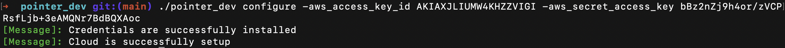
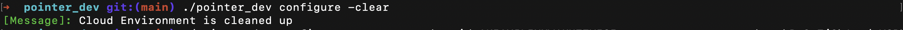
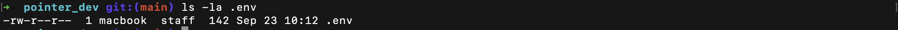
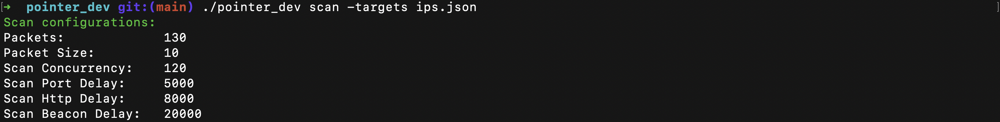
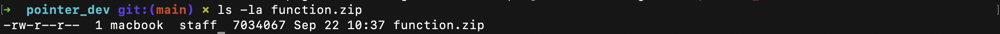
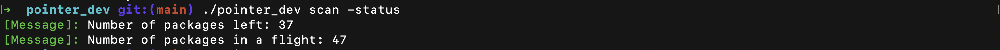
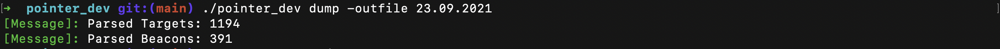
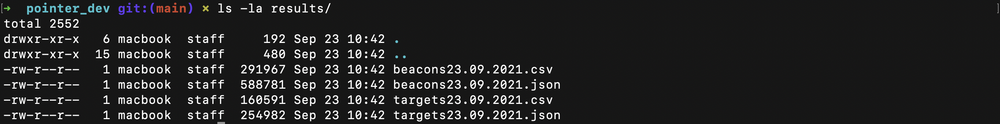

# Disclaimer

The tool in beta stage, the detailed walkthrough of main tool components is described in my blog post: [https://medium.com/@shabarkin/pointer-hunting-cobalt-strike-globally-a334ac50619a](https://medium.com/@shabarkin/pointer-hunting-cobalt-strike-globally-a334ac50619a)

I recommend using the separate AWS account for scanning and mapping the Cobalt Strike servers. 

# Description

The Pointer was developed for hunting and mapping Cobalt Strike servers exposed to the Internet. The tool involves the complete methodology for identifying the Cobalt Strike servers. It is intended to speed up the process of identifying the Cobalt Strike servers among the big number of potential targets in a short period of time.

# Install

If you have Go installed and configured (i.e. with `$GOPATH/bin` in your `$PATH`):

```
go get -u github.com/shabarkin/pointer
```

# Basic Usage

The tool is developed and heavily based on AWS SQS, Lambda and DynamoDB services. Pointer has the `configure` subcommand for automatic deployment of IAM, Lambda, SQS, DynamoDB, and Autoscaling services. To configure all of these services the Pointer needs permissions to manage them, for simplicity we recommend providing to the Pointer the administrative type of account which includes all the required permissions. That's why I recommend using the separate AWS account, especially if you are using other Lambda functions within your AWS account.

## Creating the AWS user account in AWS Console

### Instruction

1. AWS Console → IAM → User groups → Create Group → 1. Provide name of the group 2. Attach permission policy "AdministratorAccess". 
2. AWS Console → IAM → Users → Add Users → 1. Provide name of the user 2. Select "Access key - Programmatic access" → Add user to group (What we've created) 

### Video

[Screen Recording 2021-09-23 at 11.16.41.mov](_img/Screen_Recording_2021-09-23_at_11.16.41.mov)

## Credentials setup

Pointer has the `configure` subcommand with two options:

1. Automatic deployment of the AWS environment, where you should supply AWS credentials of the admin account: 

```bash
./pointer configure -aws_access_key_id AKIA85CEHPO3GLIABKZD -aws_secret_access_key LW3bDF8xJvzGgArqMo0h4kuCYsnubU23kGICGp/p
```



1. Cleaning of the configured AWS environment 

```bash
./pointer configure -clear
```



**WARNING:** It creates `.env` file, which is loaded to global variables each time you call subcommands.



## Scanning

The `scan` subcommand includes 3 options: 1. launch the scan 2. stop the scan 3. check the status of the scan

### Launch the scan

The Pointer parses the local json file (`ips.json`) with a list of IPs, optimally splits them into packets (10 IPs), and then adds the packets to be processed to the SQS queue: 

```bash
./pointer scan -targets ips.json
```

The format of the `ips.json` file:

```json
{
    "ips": [
        "1.116.119.120",
        "1.116.158.193",
        "1.116.186.39",
        "1.116.207.171",
        "1.116.246.188",
	...
    ]
}
```



The configuration action requires the `function.zip` file to be located within the directory, where a user runs the command. The `function.zip` file is actually a "Pointer server" compiled and zipped to the format required for a Lambda deployment. 



### View status of the scan

The Pointer retrieves information about the SQS Queue how many packages are in the queue and waiting for the scan and how many packages are processed at the current moment:

```bash
./pointer scan -status
```



### Stop the scan

To stop the scan, Pointer purges all the messages (packages) from the SQS Queue: 

```bash
./pointer scan -stop
```


## Dumping

All the scan results are stored in DynamoDB tables: 1. Targets, 2. Beacons. 

```bash
./pointer dump -outfile 23.09.2021
```



The only controllable parameter is the suffix for the output file, all the dumped results are saved to the to the `.csv`, and `.json` files in the `results` folder (current directory):



**WARNING:** After result dumping Pointer clears the DynamoDB tables, so you don't have a backup of obtained results, only saved one in the `results` folder.

**The data samples you may find here:** [https://docs.google.com/spreadsheets/d/1akSzGDq8ddn97rNfr7BS0w2HcoR52ircFaSMh-OEjTU/edit#gid=311496774](https://docs.google.com/spreadsheets/d/1akSzGDq8ddn97rNfr7BS0w2HcoR52ircFaSMh-OEjTU/edit#gid=311496774)

## Demo Video

[https://youtu.be/ToXfFPldGVc](https://youtu.be/ToXfFPldGVc)
